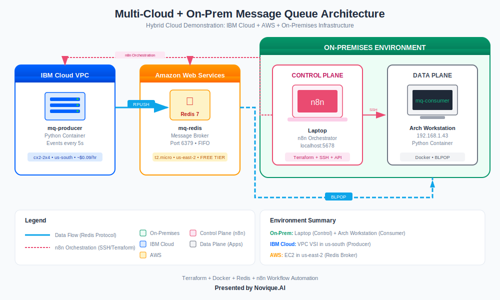

# n8n + MCP Multi-Cloud Server Management

An infrastructure orchestration platform that combines n8n automation with Terraform to build, deploy, and manage distributed applications across multiple cloud providers.



---

## Featured Demonstration: Multi-Cloud Message Queue

This repository includes a complete distributed message queue demonstration spanning three environments:

| Environment | Role | Technology |
|-------------|------|------------|
| **IBM Cloud VPC** | Message Producer | Python container on VSI |
| **AWS EC2** | Message Broker | Redis 7 on t2.micro (free tier) |
| **On-Premises** | Message Consumer | Python container on local workstation |

**Key Capabilities:**
- Infrastructure as Code with Terraform
- Container-based microservices with Docker
- Event-driven messaging with Redis
- Full workflow automation via n8n

📖 **[View Full Documentation →](docs/message-queue-lab/LAB_GUIDE.md)**

---

## Project Overview

This platform demonstrates automated infrastructure management across:
- **Local Workstation** (Docker-based development and consumer)
- **IBM Cloud** (VPC Virtual Server Instances)
- **AWS EC2** (Elastic Compute Cloud)

### System Architecture

```
┌─────────────────────────────────────────────────┐
│              Control Plane (Laptop)             │
├─────────────────────────────────────────────────┤
│  Docker Containers:                             │
│  ┌──────────┐  ┌─────────────┐                  │
│  │   n8n    │◄─┤  PostgreSQL │                  │
│  │ (5678)   │  │  (Database) │                  │
│  └────┬─────┘  └─────────────┘                  │
└───────┼────────────────────────────────────────┘
        │
        │ n8n Workflows Manage:
        ├─► Local Workstation (Docker containers)
        ├─► IBM Cloud VPC (Terraform + SSH)
        └─► AWS EC2 (Terraform + SSH)
```

---

## Quick Start

### Prerequisites

- Docker and Docker Compose
- IBM Cloud account with API key
- AWS account with access credentials
- SSH key pairs for both cloud providers

### Installation

1. **Clone the repository**
   ```bash
   git clone <your-repo-url> n8n.mcp
   cd n8n.mcp
   ```

2. **Configure environment**
   ```bash
   cp docker/.env.example docker/.env
   # Edit docker/.env with your credentials
   ```

3. **Start the stack**
   ```bash
   cd docker
   docker-compose up -d
   ```

4. **Access n8n**
   Open http://localhost:5678

---

## Repository Structure

```
n8n.mcp/
├── terraform/
│   ├── aws-ec2-ondemand/       # AWS EC2 infrastructure
│   ├── ibm-vpc-from-image/     # IBM VSI from custom image
│   └── ibm-vpc-ondemand/       # IBM VSI from base image
├── workflows/examples/
│   ├── aws-ec2-*.json          # AWS provisioning workflows
│   ├── ibm-vpc-*.json          # IBM provisioning workflows
│   └── message-queue-*.json    # Application workflows
├── scripts/
│   ├── message-queue/          # Deployment scripts
│   └── *.sh                    # Utility scripts
├── apps/
│   └── message-queue-demo/     # Producer/Consumer/Redis
├── docker/
│   ├── docker-compose.yml
│   └── Dockerfile
└── docs/
    └── message-queue-lab/      # Demonstration documentation
```

---

## Workflows

### Infrastructure Provisioning

| Workflow | Description |
|----------|-------------|
| AWS EC2 - Spin Up On-Demand | Provision EC2 with VPC, security group, Docker |
| AWS EC2 - Tear Down On-Demand | Destroy all AWS resources |
| IBM VPC VSI - Spin Up from Image | Provision VSI from custom image |
| IBM VPC VSI - Tear Down | Destroy IBM VPC resources |

### Application Management

| Workflow | Description |
|----------|-------------|
| Message Queue - Deploy Apps | Start Redis, Producer, Consumer |
| Message Queue - Health Check | Monitor all component status |
| Message Queue - Stop Apps | Stop all containers |
| Message Queue - Full Demo | Complete orchestration |

---

## Technology Stack

| Category | Technologies |
|----------|-------------|
| **Automation** | n8n, Terraform |
| **Containers** | Docker, Docker Compose |
| **Cloud Providers** | AWS, IBM Cloud |
| **Message Broker** | Redis |
| **Languages** | Python, Bash, HCL |

---

## Documentation

- [Message Queue Lab Guide](docs/message-queue-lab/LAB_GUIDE.md) - Complete demonstration walkthrough
- [AWS Setup Guide](docs/message-queue-lab/AWS_SETUP.md) - AWS EC2 configuration
- [IBM Setup Guide](docs/message-queue-lab/IBM_SETUP.md) - IBM Cloud VPC configuration
- [Troubleshooting](docs/message-queue-lab/TROUBLESHOOTING.md) - Diagnostic procedures

---

## Project Status

### Completed Phases

- ✅ Docker environment and n8n setup
- ✅ IBM Cloud VPC provisioning with Terraform
- ✅ AWS EC2 provisioning with Terraform
- ✅ Multi-cloud message queue demonstration
- ✅ Full workflow automation
- ✅ Comprehensive documentation

---

## License

MIT License - See [LICENSE](LICENSE) file for details.

---

**Presented by Novique.AI**
